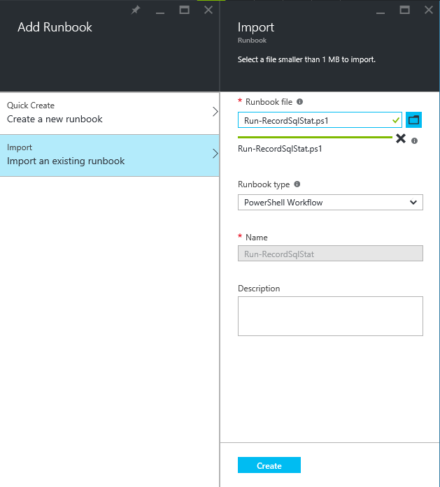

# Automation Setup

## step by step guide
0. create 'sqldbstat', 'sqldbmon' table
	* use/refer `create_table.sql`

1. create Automation

2. import runbook to Automation
	* `Run-RecordSqlStat.ps1`
	* `Run-RecordSqlMon.ps1`

	

3. create credential
	* `sqlcred (userid/password)`

4. test using following parameters

	* `Server = <irasu89u5c.database.windows.net>`
	* `Database = <ilkimdbjpe>`
	* `Table = sqldbstat`
	* `Credential = sqlcred`	
	* `BoundValue = 40 (40% performance bound)` for `Run-RecordSqlMon.ps1`

5. publish runbook

6. add schedule to run automation every day/week..

