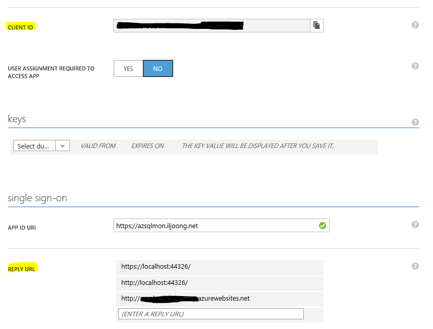

# AAD setup

## Step by step guide

1. goto management.windowsazure.com -> AAD

2. select Directory

3. choose Applications tab

4. Add Application

5. Application setting
	* add `REPLY URL` example `http://azsqlweb.azurewebsites.net`
	* copy `CLIENT ID`, `TENANT NAME` to `scripts/config.js`
    
    
