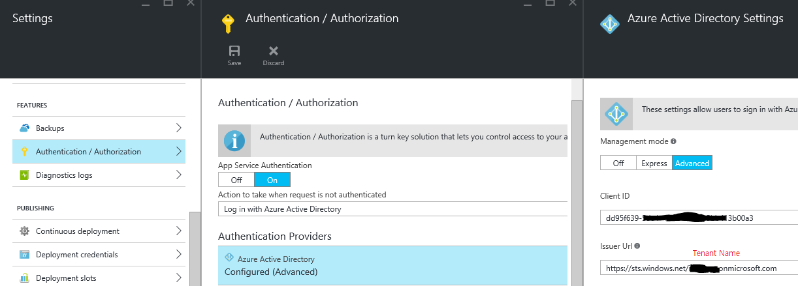

# Easy API setup

## Step by step guide

1. create api/web app

2. initialize easy api (and setup database & connection string)
    * `MS_TableConnectionString` will be created and can be accessable via `process.env.SQLCONNSTR_MS_TableConnectionString`

3. create APIs
	* `stat`
	* `perf`
    * `mon`

4. add 3 js files in wwwroot\api folder
	* `config.js`
    * `stat.js`
    * `perf.js`
    * `mon.js`

5. Extra: configure Authentication/Authorization
    * copy `CLIENT ID`, `TENANT NAME` to settings
    